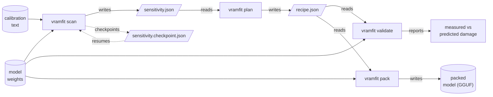
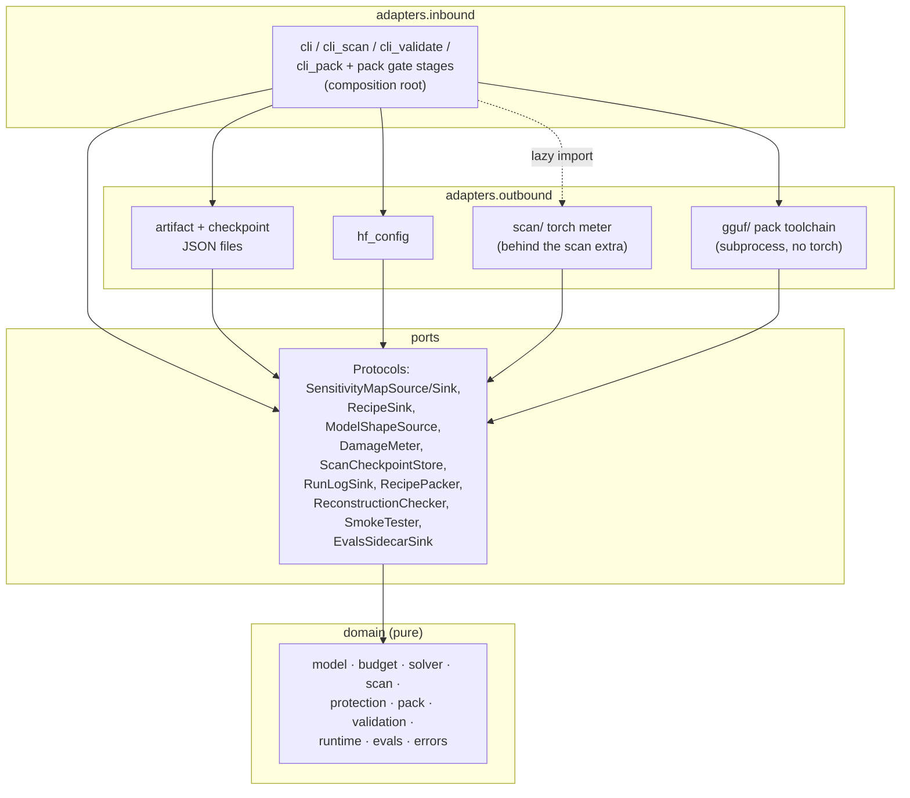
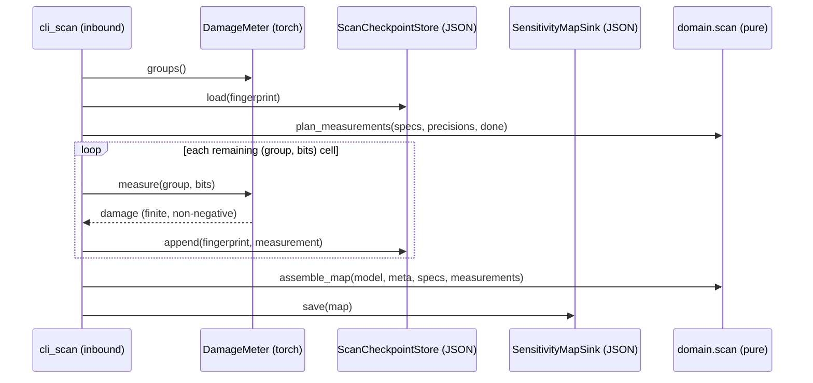

# Architecture

> **Status: draft** — describes the code on `main` through the pack
> and validate milestones. The mechanical enforcement (import-linter
> contracts) is real, and every stage below is landed code.

Two architectures coexist in vramfit, at different scales. The big one
is the pipeline: separate processes connected by versioned JSON files. The
small one is hexagonal layering inside each process. The big one does
the heavy lifting.

## The pipeline: artifacts are the real boundaries

Pack drives the llama.cpp toolchain (GGUF first, per
[ADR-0010](../adr/0010-sub-4-bit-serving-path.md) and
[ADR-0012](../adr/0012-gguf-type-mapping.md)). Validate replays the
whole recipe through the scan's meter and reports the additivity gap
([ADR-0006](../adr/0006-sensitivity-metric.md)).

Each stage is a separate process run. The artifacts between them carry a
`vramfit_schema` version and survive machine and language boundaries —
they are the strongest seams in the system
([ADR-0008](../adr/0008-hexagonal-architecture.md)). Consequences:

- A scan measured on the reference box feeds a plan run anywhere — the
  plan step needs no GPU, no torch, no model.
- Artifacts are inspectable and diffable. The sensitivity map *is* the
  publishable science output, not a cache.
- Stages version independently. A new within-group method is a new
  scan, not a schema change ([ADR-0006](../adr/0006-sensitivity-metric.md)).

## Inside a process: hexagonal layers

The layer table (ADR-0008), top may import down, never up:

| Layer | Contents | May import |
|-------|----------|------------|
| `adapters.inbound` | Typer CLI, the composition root and scan loop | everything below |
| `adapters.outbound` | JSON artifacts, HF configs, the torch meter | ports, domain |
| `ports` | `typing.Protocol` capabilities | domain |
| `domain` | dataclasses, budget math, solver, protection rules, scan/pack/validation logic, runtime capability tables, the error root | domain only |

Three import-linter contracts make this checked, not aspirational:
layer order, domain purity (no `json`/`pathlib`/`os`/`io`/`typer`/
`logging`/`structlog`), and
no heavy ML imports outside `adapters/outbound/scan/`.

## The scan loop: ports in motion

The split of responsibilities:

- **Domain** decides *what* to measure (the grid, resume filtering) and
  assembles the result — pure functions, tested in milliseconds.
- **The meter** knows *how* to measure one cell: perturb one group
  (RTN, per-block scales), run the calibration set, compare final
  logits to the cached reference, restore.
- **The store** makes every finished cell durable before the next
  starts, keyed by the scan fingerprint so two scans cannot mix.
- **The CLI** wires them together and converts every failure to a clean
  `error:` line — it is the only layer that knows about files, flags,
  and exit codes.

## Why the heavy dependencies stay optional

The base install carries typer and structlog only
([ADR-0005](../adr/0005-heavy-deps-as-extras.md), as amended by
[ADR-0011](../adr/0011-run-logs-and-error-root.md)). torch, transformers,
and accelerate arrive with `vramfit[scan]` and are imported in exactly
one package, lazily. This is not only install hygiene: it forces the
solver and the artifacts to stay pure, which is what makes the pipeline
diagram above true. Every gate that guards it (import-linter, a ty
override, a coverage carve-out) is scoped to that one package and
commented with its rationale.

## Testing mirrors the layers

Per [ADR-0009](../adr/0009-testing-strategy.md): domain logic gets unit
and hypothesis property tests. Every port has a verified-fake contract
suite — the real adapter and the in-memory fake run the same
assertions. Expensive adapters (the torch meter) run their real side in
the `integration` tier, which needs the scan extra and skips cleanly
without it. CI never installs torch — the hermetic suites prove the
orchestration against proven fakes.
