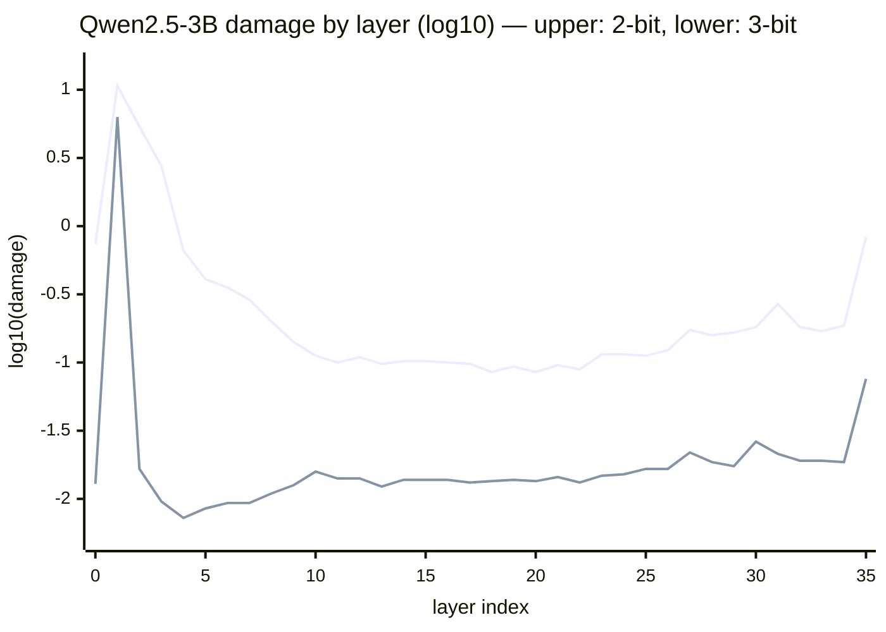

# Why selective quantization

> **Status: draft** — the reasoning is grounded in published work and,
> since 2026-07-28, in our own data: the first real-model scan
> (Qwen2.5-3B) is folded in below. Offload-aware scanning landed the
> same week ([ADR-0015](../adr/0015-offload-aware-scanning.md)), and
> the first 49B scan is running. The prior-art landscape below was
> re-surveyed 2026-07-28.

## The arithmetic that forces the issue

Weights dominate a model's memory footprint: `parameters × bits ÷ 8`.
Nemotron Super 49B at bf16 is ~98 GB. On a 24 GiB RTX 4090:

| Uniform precision | Approx. weight size | Fits with KV headroom? |
|-------------------|--------------------|------------------------|
| 16-bit | ~98 GB | No |
| 8-bit | ~49 GB | No |
| 4-bit | ~26 GB | No — over the card's total, before KV |
| 3-bit | ~19.5 GB | Barely — and uniform 3-bit quality is poor |

Uniform quantization has no answer here: the bit-width that fits wrecks the
model, and the bit-width that preserves it doesn't fit.

## What the first real scan measured

The 2026-07-28 Qwen2.5-3B scan is the project's first complete
sensitivity map from real trained weights: 37 groups × 4 precisions,
148 cells, 32,768 calibration tokens, 57 minutes on the reference box.
The damage profile by depth (log scale — each unit is 10×; the upper
line is 2-bit, the lower line 3-bit):

Four findings, in order of how much they matter to the solver:

1. **A single layer can be the whole story.** Layer 1 at 3-bit takes
   damage 6.28 — its neighbor layer 0 takes 0.013 at the same
   precision, a ~490× gap between *adjacent* layers. Across all 37
   groups the 3-bit spread is ~870×. Even at 4-bit, layer 1 (0.038)
   costs 11× the median group. No depth heuristic predicts this: "protect
   early layers" treats layers 0 and 1 the same, and they are not
   remotely the same.
2. **The 2-bit profile is a U-curve, not a slope.** Damage falls from
   the front of the stack (layer 2: 5.36) to a mid-stack floor
   (layers 13–22 average 0.095), then rises again toward the top
   (layer 35: 0.83). The folklore says "early layers matter more" —
   the measured shape says *both ends* matter and the middle is ~10×
   cheaper than either end.
3. **The embeddings are expensive to crush.** Not on the chart
   (layer axis only): 2-bit damage 2.26, 3-bit 0.25 — among the worst
   groups at every precision below 8-bit. On a 3B with a
   151,936-token vocabulary they are ~10% of the parameters, and
   Qwen2.5 ties them to the output head, so crushing them hurts twice.
4. **The meter behaves.** 8-bit damage sits in a narrow
   0.0005–0.0012 band across every group — far below any group's
   4-bit cell — and every damage curve is monotone in bits. Real
   measurement, sensible instrument.

### What the solver did with it

The same day, `quantfit plan` solved this map at four weight budgets.
The recipe adapts exactly where the map says to spend:

| Weight budget | Recipe mix | Predicted damage |
|---------------|-----------|------------------|
| 4.00 GiB | 37 × 8-bit | 0.032 |
| 3.00 GiB | 36 × 8-bit, 1 × 4-bit | 0.033 |
| 2.00 GiB | 9 × 8-bit, 28 × 4-bit | 0.099 |
| 1.32 GiB | 16 × 4-bit, 21 × 3-bit | 0.402 |

The 2.00 GiB row is the thesis in one line: the nine groups the
solver kept at 8-bit are exactly the nine with the highest measured
8→4-bit damage increase — the embeddings, layers 1 and 2 at the
front, and the fragile top of the stack (27, 30, 31, 33–35). Nobody
encoded "protect both ends and layer 1". The map did.

The 1.32 GiB row shows something subtler: **fragility rank depends on
precision.** The solver holds the embeddings, layer 1, layer 10, and
the top third of the stack at 4-bit — exactly the sixteen highest
4→3-bit damage increases — and takes the rest to 3-bit, *including*
layer 2. Layer 2 is second-worst in the model at 2-bit (5.36) yet
only 14th-worst at 3-bit (0.016): cheap to take to 3 bits,
catastrophic to take to 2. A single "fragile layers" list cannot
express that. Damage curves can, and each recipe carries its trace,
so every downgrade is replayable.

### What this data may not claim

One model, one calibration set. Damage values are only comparable
within one calibration set, and the scan measures groups marginally —
the additivity assumption (total recipe damage ≈ sum of marginal
damages) stays unverified until the whole-recipe validation pass
(issue #8) runs. The findings above are evidence the fragility
profile is real, sharp, and model-specific. They are not yet evidence
that a packed recipe wins end-to-end — that is what
[evaluating packed models](evaluating-packed-models.md) is for.

## Why non-uniform works

The Qwen scan is one model; the literature says the shape generalizes.
Consistent findings across the quantization corpus (GPTQ/AWQ lineage,
llama.cpp k-quants, NVIDIA's Minitron work):

- **Embeddings, first blocks, last blocks** disproportionately affect output
  quality — cheap insurance to keep at high precision.
- **Attention projections** are typically more fragile than MLP weights.
- **Outlier channels** — a small fraction of weights with large magnitudes —
  carry outsized importance (the insight behind AWQ). Layer 1's
  anomaly is plausibly this class made visible at group granularity.
- **Most mid-stack MLP mass tolerates aggressive crushing** — and MLPs are
  where most of the parameters are.

Existing tools encode these as fixed heuristics. The fragility *profile*
differs per architecture — a hybrid or MoE model distributes importance
differently than a dense llama-style stack — and the Qwen data shows it
also differs layer-to-layer in ways no heuristic table carries. A recipe
measured for the actual target model should beat a generic one. That
measured-per-model bet is the project's core hypothesis, and the
49B-on-a-4090 benchmark is its test.

## The prior art we're standing on

A 2026-07-28 survey found the field converging on measure-then-mix
from several directions at once. That convergence is evidence the
approach is right — and it means the honest claim is a differentiated
*pipeline*, not a novel *idea*.

- **antirez/ds4** — proved the depth-over-breadth ethos: selective
  quantization hand-tuned for one model (DeepSeek V4 Flash) beat generic
  runtimes' recipes for that model.
- **llama.cpp k-quants + imatrix** — non-uniform layer recipes (heuristic)
  plus measured activation statistics applied *within* blocks. And now
  more: an active
  [auto-adaptive mixed-precision effort](https://github.com/ggml-org/llama.cpp/discussions/18531)
  measures per-tensor quantization error across formats and runs a
  Lagrangian solver against a `--target-size` or `--target-bpw`. The
  closest convergent work, inside the runtime we pack for — either the
  strongest competitor or a future pack backend.
- **EXL2/exllamav2** — the longest-standing relative: measured per-layer
  bitrate mixing to hit a target average bpw, welded into its own engine
  and format.
- **Unsloth Dynamic 2.0 GGUFs** — per-layer sensitivity measured during
  quantization, every layer assigned its own type, schemes differing per
  architecture, shipped at scale with leading KL benchmarks. The
  measurement stays inside their pipeline.
- **NVIDIA Model Optimizer `auto_quantize`** — gradient-based per-layer
  sensitivity scores searched under an *effective-bits* constraint (the
  same concept [ADR-0014](../adr/0014-per-type-effective-bits.md) reached
  independently), targeting NVIDIA's serving stack.
- **AWQ / GPTQ** — calibration-aware weight quantization within a uniform
  target precision; quantfit's selectivity operates a level above (which
  precision per group), and can use these as the within-group method.

### Where quantfit stands in that field

Four edges survive contact with the landscape, and they compound:

1. **Telemetry.** Every other tool measures a proxy — local weight
   error, Fisher scores, gradients — consumes it internally, and
   discards it. quantfit's damage is end-to-end KL at the final
   logits, and the measurement *is* the product: a versioned,
   resumable, inspectable sensitivity map, with run logs beside it
   ([ADR-0011](../adr/0011-run-logs-and-error-root.md)).
2. **Thoroughness.** End-to-end measurement costs more per cell and
   buys fidelity the proxies cannot see (error propagating through
   depth — [ADR-0006](../adr/0006-sensitivity-metric.md) rejected
   layer-local error for exactly this). The validation pass then
   re-measures the whole recipe against the summed prediction — no
   other tool in the list checks its own additivity assumption.
3. **Plug and play.** The pipeline stands alone: scan any HF
   checkpoint, carry the recipe as a portable artifact with
   provenance and trace, retarget runtimes through the capability
   table ([ADR-0013](../adr/0013-runtime-capability-in-recipes.md)).
   Everyone else is welded to one engine.
4. **Target-use customization.** The solver packs against *your
   deployment*: VRAM minus KV headroom at your intended context and
   concurrency — not a file-size or average-bits target. Issue #29
   sketches deepening this into a budget command that derives the
   weight budget from stated intent.
